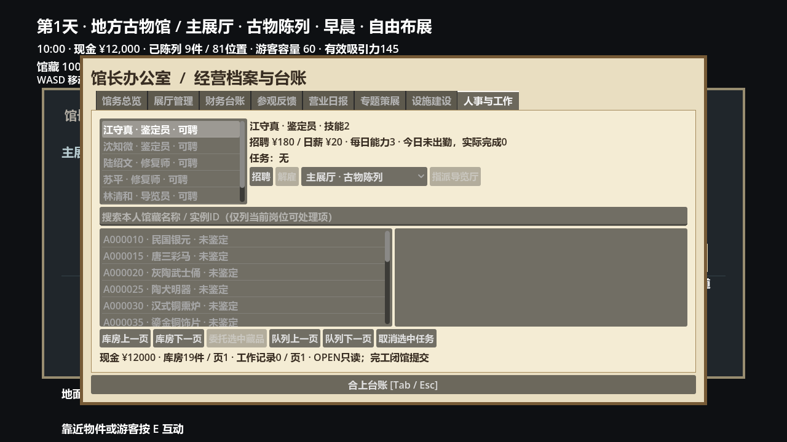
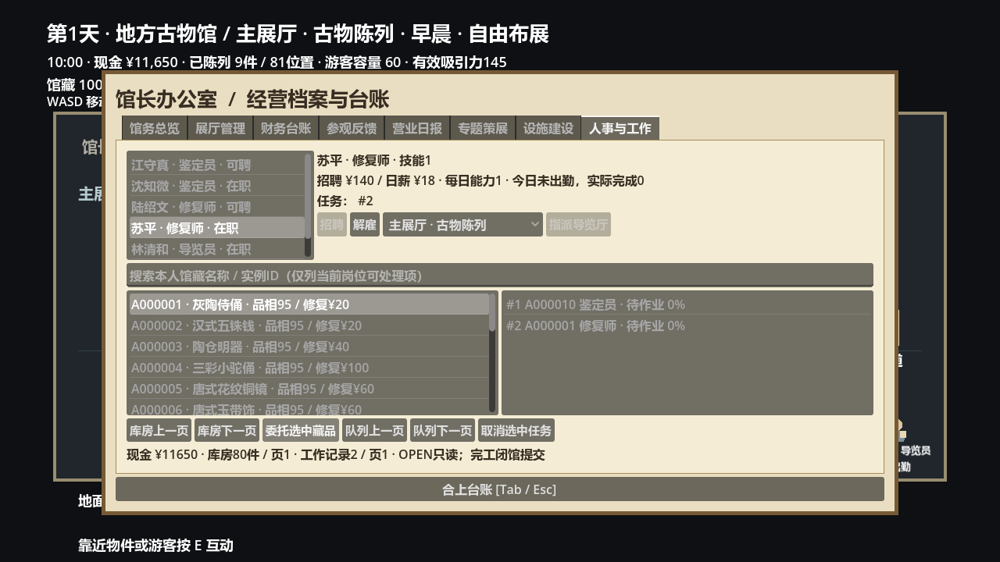
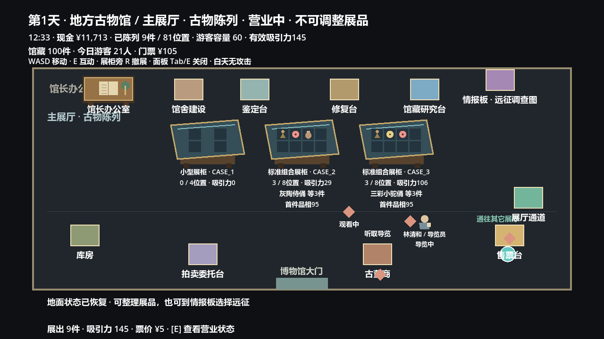
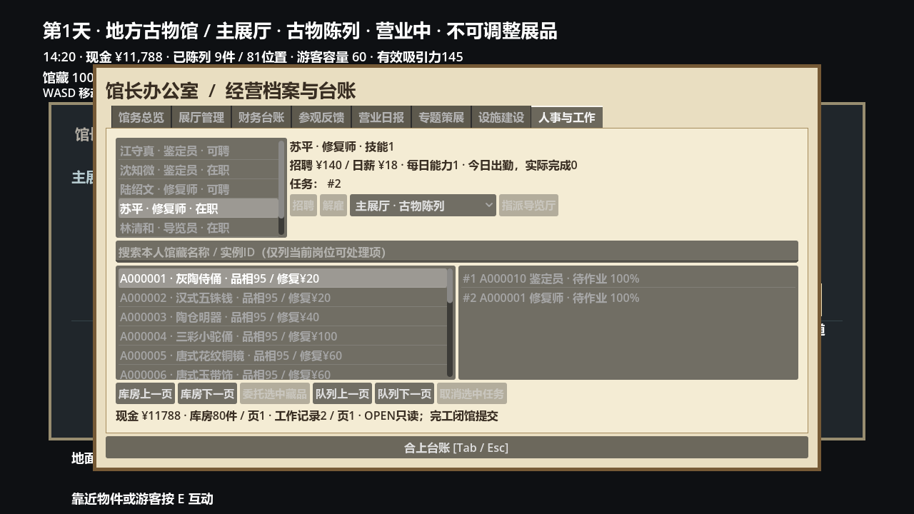
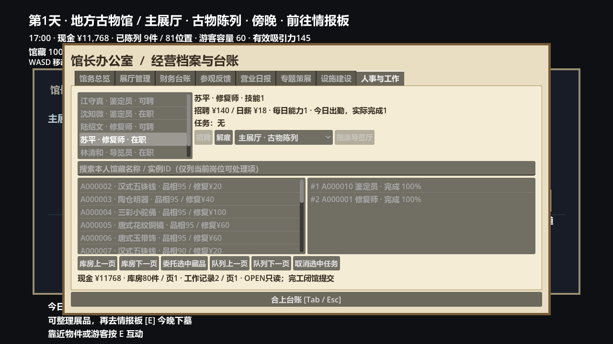
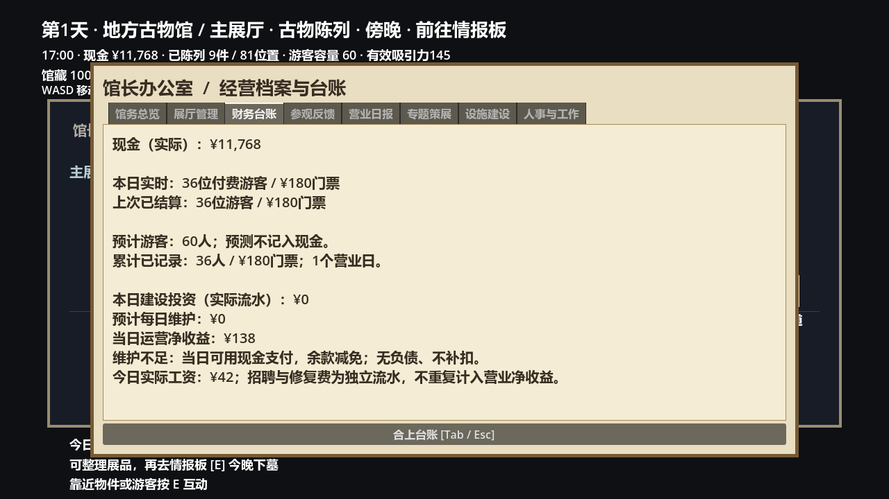

# Phase 11F — 博物馆员工与工作任务验收

2026-10-09。基线 `fda7d92efbe0a86dd3f8a97662d42f78eb6722ac`，分支 `codex/phase-11f-museum-staff`。本地、origin/11E均核对一致后创建，保留全部前置改动。main仍为`aaefb2e653cdbfa1dd87deb4e46ba5772fdef72c`。自动/图形验证通过；用户出差，**人工验收待完成**。不合并main，不继续11G，不访问正式玩家档。

## 实际功能和职责

- `data/museum/staff.json`六个固定身份与能力，全馆最多6人、每岗位2人；无随机场景ID、员工经验升级或新战斗增益。
- `MuseumStaffDefinition/Member/Roster/Service`配置、实际雇员、记录及合法招聘/解雇/指派事务。招聘/解雇仅MORNING/EVENING；重复招聘不扣钱。离职保留员工、已完成任务及取消的未完成任务；可付招聘费重新雇用同一稳定身份。
- `MuseumStaffWorkday`仅本次营业的出勤/预约/进度，`MuseumStaffPayroll`开馆支付，`MuseumStaffTasks`绑定实际馆藏作业。UI不修改馆藏归属或实现费用公式。
- 馆长办公室第八页“人事与工作”：实际按钮招聘/解雇/指派厅，按岗位搜索馆藏、委托、取消及查看历史。库房和队列每页最多20条；原七页、人工鉴定/修复、馆舍/拍卖/远征继续保留。

## 员工配置

|员工ID / 名称|岗位|招聘费|日薪|技能|每日能力|一次实际工作秒数|
|---|---|---:|---:|---:|---:|---:|
|GUIDE_LIN 林清和|导览员|90|10|1|8次|0.6|
|GUIDE_ZHOU 周文远|导览员|140|14|2|12次|0.5|
|APPRAISER_SHEN 沈知微|鉴定员|120|14|1|2件|8|
|APPRAISER_JIANG 江守真|鉴定员|180|20|2|3件|6|
|CONSERVATOR_SU 苏平|修复师|140|18|1|1件|12|
|CONSERVATOR_LU 陆绍文|修复师|220|26|2|2件|9|

全员招聘¥890、日薪¥102。按现有¥5票价，初级馆10人上限毛收入¥50，三级60人上限¥300；人员选择有实际成本。参数是本版提案，未声称真人经济平衡完成。

## 导览的真实证据

`MuseumGuideNPC`是真实Godot Node2D，进入展厅后走向导览站，等待真实游客预约。每个NPC一次服务一位，服务完成才增加计数/反馈，不能改变已付费游客数和票款。游客走到NPC旁听取导览，再继续观看；与导览牌共用每人一次导览标记，最多三柜。没有付费游客/未支付工资/关闭/不在指定展厅/日能力耗尽不产生服务。

博物馆最多保留两个真实导览演员，非当前厅演员隐藏但仍存在；只实例化当前厅陈列设施的原规则不变。NPC无实体碰撞，不堵通道。卸载移除ready及预约；失去NPC的游客不会拿到虚假加成，继续正常离场/参观。原设施导览不会与员工重复计入收益。实际NPC卸载、恢复、换厅、闭馆均有专项。

## 鉴定、修复与结算时序

1. 合法地面阶段选择自己拥有的实例，入PENDING；排队不修改identified/condition。
2. 开馆全额逐人支付工资，稳定ID顺序。未能支付者当日停工，无欠款，仍可开馆。无员工时保持11E原经济。
3. 仅OPEN真实物理帧推进已出勤员工任务。日能力封顶；任务准备完毕可显示100%，仍不提前修改藏品。
4. 提前闭馆停止新工作；等实际游客离场后维护费用结算，统一提交鉴定、修复和日报。
5. 修复费用沿用原规则：稀有度[20/40/60/100]乘以ceil((100-condition)/10)。排队及完工再次验证实际实例、鉴定、拍卖锁和现金；现金不足WAITING_FUNDS，非免费修复，品相和陈列归属不变。
6. 提交后COMPLETED记录、日期、fee_paid及工资/日报只处理一次。未完成进度仅闭馆后保存，离线不推进；手动鉴定/修复、售出、待拍或失踪任务取消/跳过并保留记录。

实际GameFlow专项通过：真实售票台E开馆→作业进度→OPEN期间安全快照不变→重载仍为开馆前现金与未完成任务→闭馆后保存已完成鉴定和¥14工资。不能保存半完成OPEN，也不保存NIGHT。

## 财务和30天真实营业

`ticket_income`仍为门票毛收入，`maintenance_paid`为实际设施维护；新增`staff_wages_paid`。`operating_net_income = ticket_income - maintenance_paid - staff_wages_paid`。招聘及修复作为独立员工支出流水，不再次计入经营净收益。原设施支出链未改成员工链。

30日隔离Museum真实OPEN物理帧模拟：3员工（林/沈/苏），9件实际展出、100件馆藏、照明1级；测试只加速营业/作业参数，生产60秒营业、工作时间倍率1保持。每日出勤日薪¥42，鉴定/修复各一件真实任务。

|流水|数值|
|---|---:|
|初始现金|20,000|
|招聘投资|350|
|照明投资|80|
|实际门票毛收入（330人）|1,650|
|实际工资|1,260|
|实际维护|30|
|独立修复费|240|
|经营净收益|360|
|最终现金|19,690|

`20,000 - 350 - 80 + 1,650 - 1,260 - 30 - 240 = 19,690`，现金逐日一致；重复开馆/工资/闭馆不再扣费/完成任务。缺款员工零出勤、缺修复费零修复，现金不会为负。没有员工的旧11E30日及维护短缺测试全部通过。

## VERSION8迁移与安全

v1～7沿用已有前向恢复，v8追加员工纯值身份/等级、分配、任务、独立费用和工资日账。v7读取不凭空生成雇员或历史工资；原馆藏实例、鉴定/品相/现金/50定义/设施等级/陈列/专题/日报/拍卖/Campaign保留。首次前向写入先保留旧文件完整字节的SHA命名备份。

解码先构造临时roster，校验身份/岗位/技能、未解锁厅、重复ID/任务、顺序费用、工资与日报、完工任务与维修流水/计数。已不存在的古董挂起任务安全取消，历史完成记录允许引用已售实物。非法员工或冲突财务阻止后续写入，保留已经恢复的馆藏，原档不覆盖。员工页重载仍读取当天持久化出勤/工资，不错误显示未出勤。旧/新档外部修改、坏档、备份冲突均沿用拒绝覆盖机制；不以空档替换原文件。

## 自动测试

使用Godot4.6.2 Windows及仓库既有Python环境。最终49套headless：**338,210 checks / 0 failures**，其中历史44套337,999全部保留；未删除旧断言。另GameFlow7、真实图形20、正式场景启动3：合计338,240个Godot断言。数据库Python107/107通过。预期坏档WARNING是拒绝写入的证据；扫描SCRIPT ERROR/ERROR没有忽略错误。

|套件|checks|failures|
|---|---:|---:|
| 1 | 27 | 0 |
| 2 | 204 | 0 |
| 3 | 94 | 0 |
| 4 | 105 | 0 |
| 5a | 61 | 0 |
| 5b | 236 | 0 |
| 6 | 164 | 0 |
| 6_5 | 174 | 0 |
| 7a | 306 | 0 |
| 7b | 722 | 0 |
| 8a | 486 | 0 |
| 8b | 305 | 0 |
| 8c | 297 | 0 |
| 8d | 2153 | 0 |
| 9a | 10513 | 0 |
| 9b | 30758 | 0 |
| 9b2 | 4843 | 0 |
| 9b3 | 29133 | 0 |
| 9b32 | 1734 | 0 |
| 9b33 | 2702 | 0 |
| geometry | 206885 | 0 |
| softlock | 1030 | 0 |
| baseline | 728 | 0 |
| 10a | 49 | 0 |
| 10d_bridge | 9 | 0 |
| 10d_media | 11 | 0 |
| 10d | 40 | 0 |
| 10d6 | 91 | 0 |
| 11a | 717 | 0 |
| 11b_tombs | 1172 | 0 |
| 11b_catalog | 178 | 0 |
| 11b | 40973 | 0 |
| twin_death_hotfix | 47 | 0 |
| 11d1 | 7 | 0 |
| 11d2 | 20 | 0 |
| 11d3 | 9 | 0 |
| 11d4 | 169 | 0 |
| 11d5 | 235 | 0 |
| 11d_flow | 108 | 0 |
| 11e1 | 335 | 0 |
| 11e2 | 19 | 0 |
| 11e3 | 9 | 0 |
| 11e4 | 131 | 0 |
| 11e5 | 10 | 0 |
| 11f1 | 23 | 0 |
| 11f2 | 18 | 0 |
| 11f3 | 14 | 0 |
| 11f4 | 129 | 0 |
| 11f5 | 27 | 0 |

旧测试仅将当前Profile版本断言7改8，保留原Seed777、品相73和全部原行为。数据库保护清单只追加museum_config.gd准确SHA（生产倍率1的隔离加速入口）；战斗/Boss/遗物/8件本体等保护不删。

50/100/500基础馆藏真实员工页验证均通过（另加7件作业夹具），最后专项刷新约0.4/0.6/3ms（单机采样，非跨硬件承诺）；分页20，未创建500行UI节点。30日及新旧存档均只用logs下隔离磁盘文件或内存，未读写正式user档。

测试命令（在仓库根目录，将Godot替换为本机Godot4.6.2 executable）：

```powershell
Godot --headless --path . --editor --import
Godot --headless --fixed-fps 60 --path . --script tests/phase_11f1_smoke.gd
Godot --headless --fixed-fps 60 --path . --script tests/phase_11f2_smoke.gd
Godot --headless --fixed-fps 60 --path . --script tests/phase_11f3_smoke.gd
Godot --headless --fixed-fps 60 --path . --script tests/phase_11f4_smoke.gd
Godot --headless --fixed-fps 60 --path . --script tests/phase_11f5_smoke.gd
Godot --headless --fixed-fps 60 --path . --script tests/phase_11f_flow_smoke.gd
Godot --path . --script tests/phase_11f_graphical.gd
Godot --path . --script tests/phase_11f_startup.gd
python -m unittest discover -s database/tests -v
```

完整历史套件名称在上表；统一以`tests/phase_<名称>_smoke.gd`执行，softlock=`phase_softlock_smoke.gd`、baseline=`phase_player_baseline_smoke.gd`，10d_bridge/media为同名无_smoke后缀。日志与运行器仅logs，不加入Git。

## 真实Godot截图

来自真实viewport PNG与WASD/E/鼠标测试，没有HTML模拟。








## 五阶段提交与试玩

- 11F.1 `25ba785`，员工配置、招聘与稳定身份。
- 11F.2 `d158231`，真实付费游客导览与一次限制。
- 11F.3 `b97d71f`，真实鉴定/修复工作队列。
- 11F.4 `e1650f8`，工资、经营对账与v8迁移。
- 11F.5 最终界面、额外生命周期/存档边界、全回归、截图及本报告；最终SHA和push核对以交付消息、`git log -1`为准。

最终push本分支，不合并main。启动：

```powershell
Godot --path . --script tests/phase_11f_playtest.gd
```

隔离内存夹具：100件馆藏、测试资金12,000（招聘三员工后11,650）、导览/鉴定/修复各一名、两件待处理任务；正式营业时间与作业参数。真实走到办公室并打开人事页，Tab关闭后售票台E开馆；员工工资开馆扣、工作闭馆生效。全程不访问正式用户存档。

## 已知限制和人工待验

- 固定六员工、技能等级固定，没有复杂随机人物、招聘市场、员工经验或自由导航。
- 首版导览采用两处固定站点与现有展厅路线，非完整跟队带游；仍由实际NPC与游客完成、可增加一次实际观看。
- 鉴定/修复按真实营业作业时间和日能力推进，闭馆统一入账；100%准备并不等于营业中可用。修复付款优先级为工资→维护→修复，可能需次日继续。
- OPEN中退出仍回到开馆前快照，不提供营业中断恢复；这是保留既有安全规则。没有工资欠债或离线作业。
- 人事界面可读性、导览直观程度、薪资/能力的长期选择，以及用户旧档实际体验仍待回程人工验收。自动测试不冒充真人经济体验。
- 50古董数值、地区掉落、远征/拍卖、双生尸煞、研究资料授权及审核状态未变。不增加战斗增益或下一阶段内容。
