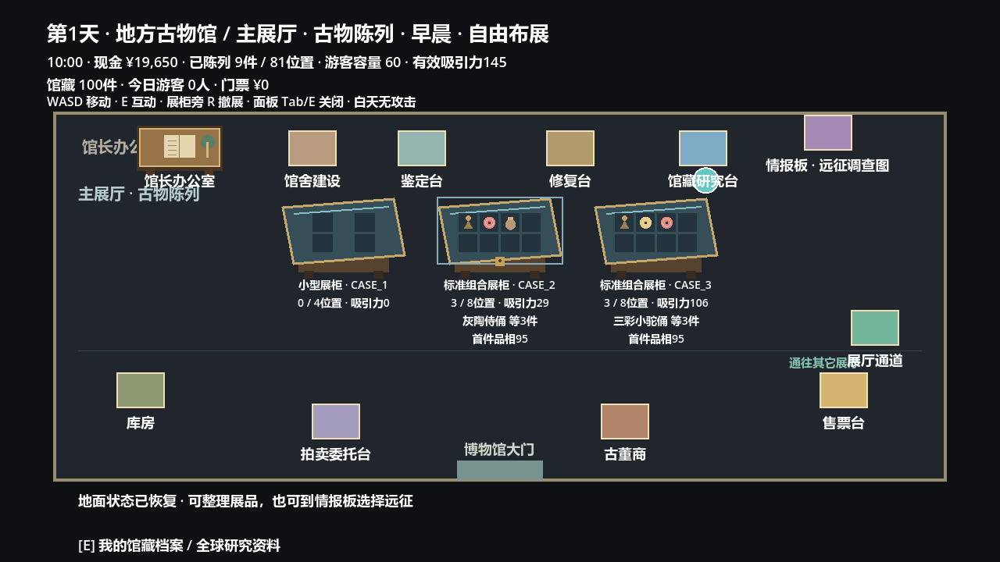
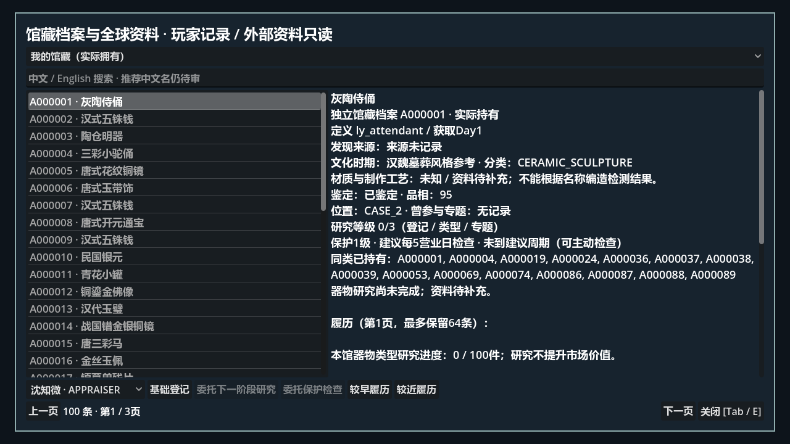
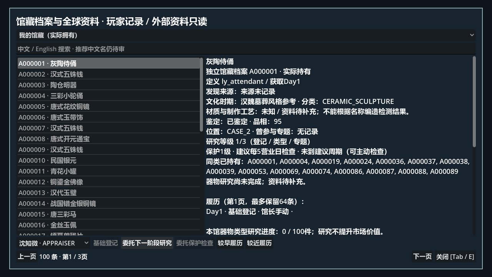
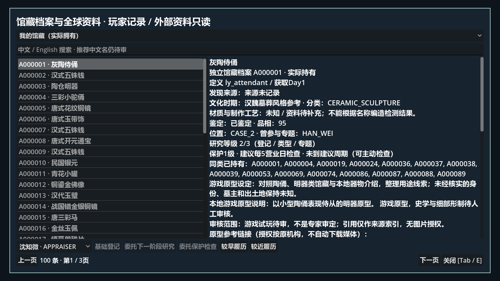
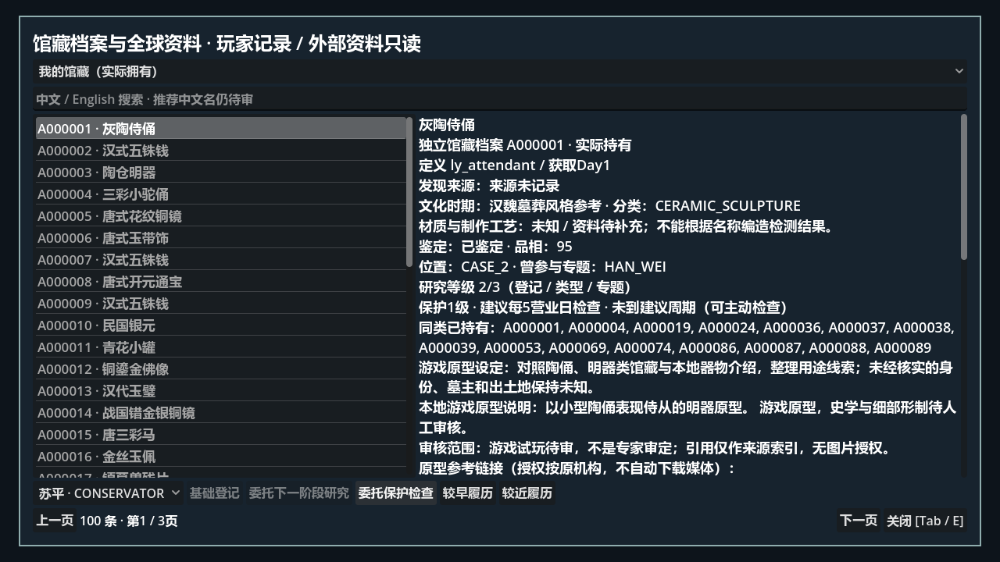
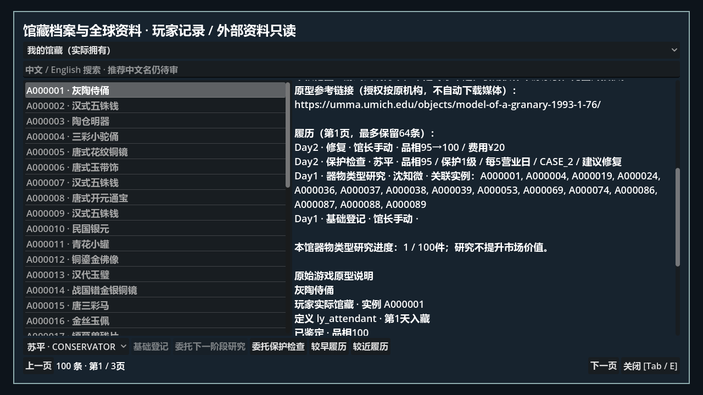
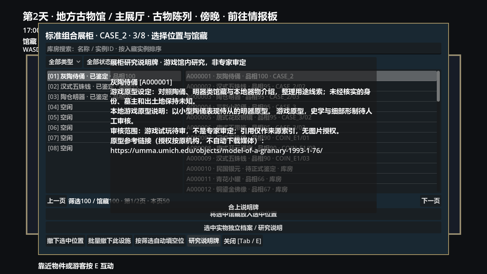
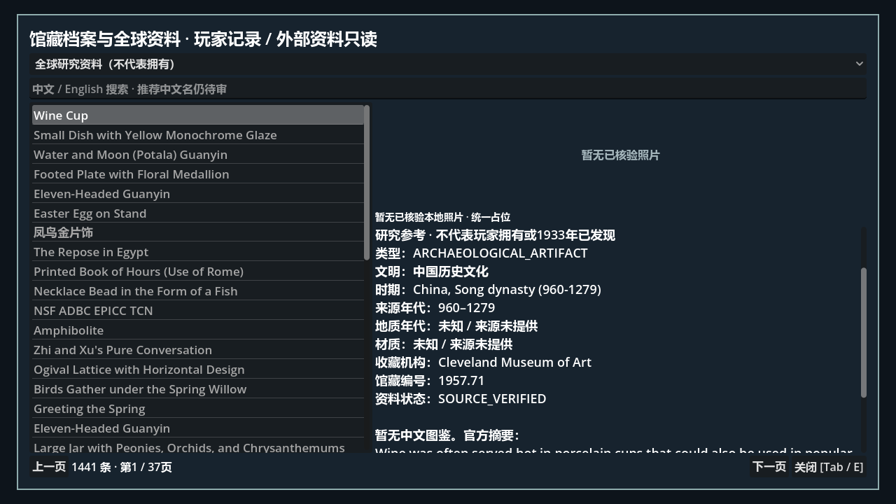

# Phase 11G 馆藏档案、研究与保护验收

状态：自动验证完成；用户出差，真人试玩待验收。基线8cd2cfe0279f57b175a1d013a5ee180349cc80ae，独立分支codex/phase-11g-collection-research。不合并main，不操作正式玩家存档。

## 实现与规则

CollectionResearchRecord按真实instance_id保存定义、获得日、来源、鉴定/品相快照、研究等级、专题与履历。同种两件不覆盖。GameFlow成功带回时从实际ExpeditionSelection与RunResult记录site_id、region_id、run_seed、expedition_day；旧档无记录显示来源未记录。出售/拍卖保存明确“不再持有”的简档，不能继续陈列或研究。

ResearchDefinition读取data/museum/collection_research.json。阶段1鉴定后手动登记；阶段2鉴定员进行类型研究；阶段3同专题至少3件实际持有已完成类型研究物品且至少2种定义。未知类型不能假装满足专题。类型关联按实际器物分类，专题关联按钱币/汉魏/唐等配置。说明采用本地游戏原型内容并附原定义来源索引；没有资料的材质、工艺保持未知。示例：汉魏器物完成类型研究后显示原型用途说明，满足实际相关馆藏条件后显示专题关联实例。它不是专家审定结论，无价格、吸引力或战斗增益。

复用MuseumStaffTask/Workday：研究时间为原员工任务时间×1.5（类型）/×2（专题），检查×0.5；沈鉴定员分别12/16秒，苏修复师检查6秒。共用已有每日能力和开馆工资。OPEN只推进实际工作，闭馆提交；未出勤不推进，取消/出售/手动完成安全失效，无重复工资。检查绑定真实实例，不改品相、不收费；PROTECT0/1/2/3建议周期3/5/7/10实际营业日，移动按新环境重算。无随机损坏、被动品相下降或强制停业。

人工/员工修复仍按原规则收费：每10点不足品相按稀有度20/40/60/100元计，向上取整，成功到100；只记录同一实际事务。履历包含日期、执行者、实例、修复前后与实付费，检查包含实际陈列设施、保护级别、品相及修复建议。

## 界面与性能

研究台E打开我的馆藏/全球资料；库房选中实例与办公室快捷入口均进入独立档案。档案优先显示真实记录，支持登记、选择员工研究/检查、任务与历史分页；已离馆独立只读。组合柜有研究说明牌。50/100/500件测试均40条分页，履历每页12条。全球资料仍是原有本地精选目录，不将50,794 JSON全部加载，研究索引不是玩家库存。

每实例最多64事件，最多1000离馆简档，整体档案写入上限10000；超限拒绝写入而非覆盖原档。旧离馆简档按身份顺序裁剪，历史关联只表示历史身份，不冒充当前拥有。

## 存档与安全

VERSION9支持v1～8。真实v8隔离档迁移与字节级备份验证；完整保留馆藏身份/定义、品相、鉴定、陈列、专题、设施、现金、费用链、员工、日报、拍卖与Campaign。缺失来源不猜测。来源地域不一致、未知URL、非法执行者/任务角色、重复档案、不存在的引用、外部改档拒绝覆盖；OPEN/NIGHT旧保护不变。序列化纯字符串而非StringName保证内存与磁盘往返一致。正式新游戏仍空馆、零现金、无员工，无测试赠品。

## 自动验证

历史54组headless：338,328 checks，0 failures；所有进程0退出，无SCRIPT ERROR或ERROR。各组实际结果如下：

|组|检查|失败|
|---|---:|---:|
|1|27|0|
|2|204|0|
|3|94|0|
|4|105|0|
|5a|61|0|
|5b|236|0|
|6|164|0|
|6_5|174|0|
|7a|306|0|
|7b|722|0|
|8a|486|0|
|8b|305|0|
|8c|297|0|
|8d|2153|0|
|9a|10513|0|
|9b|30758|0|
|9b2|4843|0|
|9b3|29133|0|
|9b32|1734|0|
|9b33|2702|0|
|geometry|206885|0|
|softlock|1030|0|
|baseline|728|0|
|10a|49|0|
|10d_bridge|9|0|
|10d_media|11|0|
|10d|40|0|
|10d6|91|0|
|11a|717|0|
|11b_tombs|1172|0|
|11b_catalog|178|0|
|11b|40980|0|
|twin_death_hotfix|47|0|
|11d1|7|0|
|11d2|20|0|
|11d3|9|0|
|11d4|169|0|
|11d5|235|0|
|11d_flow|108|0|
|11e1|335|0|
|11e2|19|0|
|11e3|9|0|
|11e4|131|0|
|11e5|10|0|
|11f1|23|0|
|11f2|18|0|
|11f3|14|0|
|11f4|129|0|
|11f5|27|0|
|11g1|4|0|
|11g2|9|0|
|11g3|5|0|
|11g4|18|0|
|11g5|75|0|

Python历史数据库107 tests通过。Godot导入解析正常，正式GameFlow场景使用in_memory启动3项通过；未读取正式档。真实11B洛阳/关中四条Seed33/52完整回馆流程保留，并新增来源/地区/RunResult Seed验证。双生尸煞、三地区、拍卖、研究版权与全部旧历史断言保留；旧测试仅当前VERSION期望升级和精确GameFlow导出hash调整，未削减断言。

30日真实OPEN/闭馆模拟：初始20000，招聘260，建设90，票款1650（330付费游客），工资960，维护30，修复20，现金20290。公式20000-260-90+1650-960-30-20=20290，经营净收益660；研究/检查无额外工资或费用。保存往返一致、撤展周期更新、出售后只读均验证。

命令（Godot4.6.2）：

```powershell
Godot --headless --editor --import --path .
Godot --headless --fixed-fps 60 --path . --script tests/phase_11g5_smoke.gd
Godot --fixed-fps 60 --path . --script tests/phase_11g_graphical.gd
Godot --path . --script tests/phase_11g_playtest.gd
python -m unittest discover -s database/tests
```

完整历史分别运行tests/phase_*_smoke.gd（54组）；特殊入口phase_10d_bridge.gd、phase_10d_media.gd、phase_softlock_smoke.gd、phase_player_baseline_smoke.gd。图形专项使用真实WASD、E与鼠标，工作时间仅隔离夹具加速，正式参数不改。

## 五阶段提交

1. 817929e 独立档案与远征来源。
2. e18989f 研究配置与内容。
3. 2618fff 原员工任务集成。
4. 836b838 检查、修复与V9。
5. 本报告所在提交：界面、图形、历史回归与交付（最终SHA见Git历史/交付消息，避免自引用）。

## 人工待验事项

研究台信息阅读、任务操作、检查提示与研究说明牌体验仍待真人确认。材料/工艺缺失保留未知，游戏原型及引用不等于史学专家批准，11C审核与媒体权限不改。旧离馆简档超过1000会裁剪，研究不是无限收益工具。完成停止，不自动11H。

## 真实Godot图形证据

图形专项31项，0失败，无脚本错误。以下均为实际Godot viewport截图，不是HTML模拟。
















