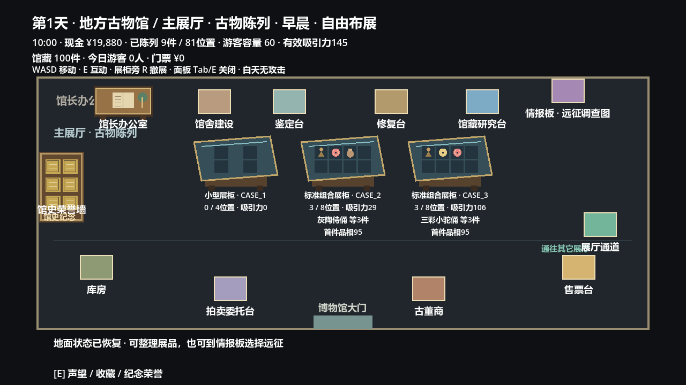
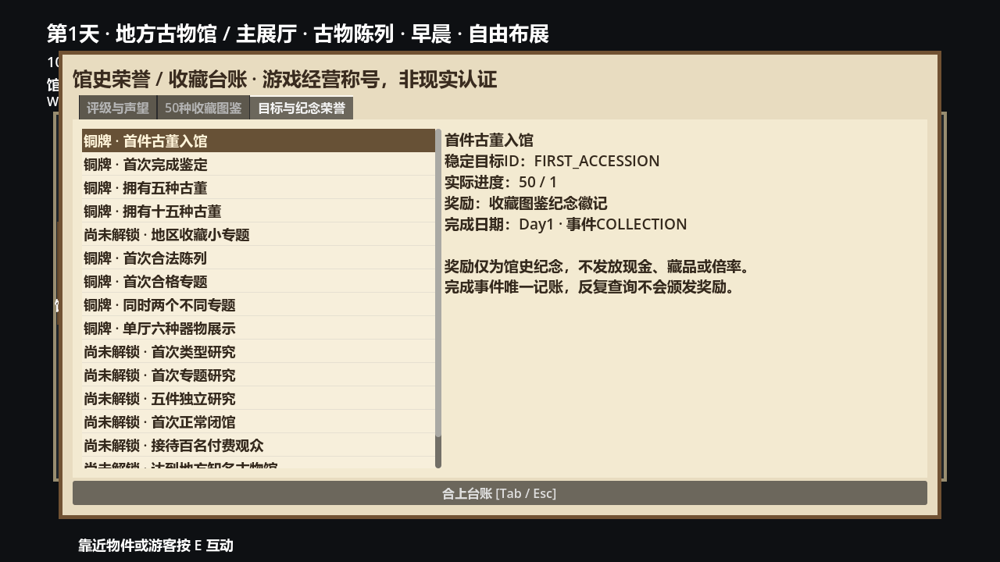
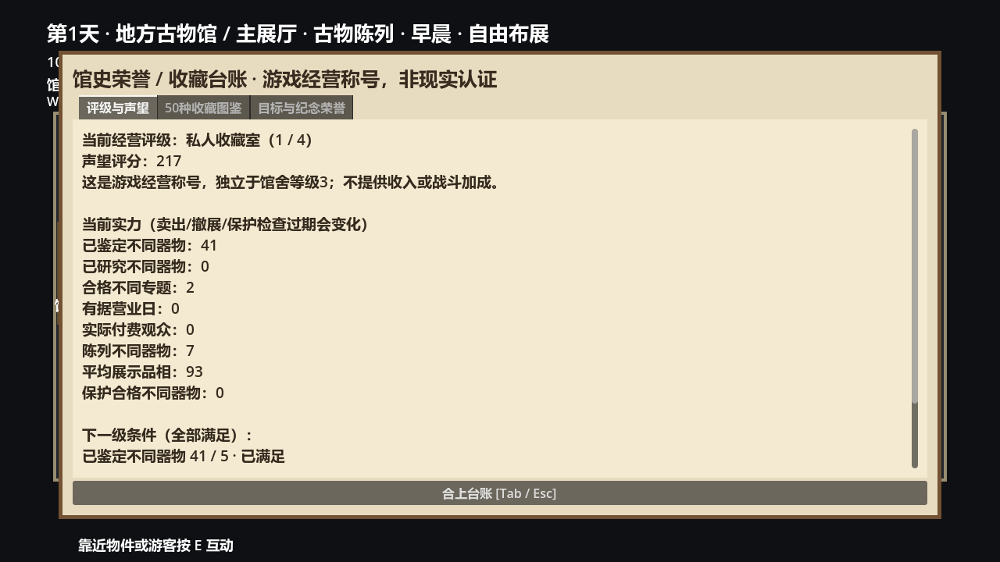
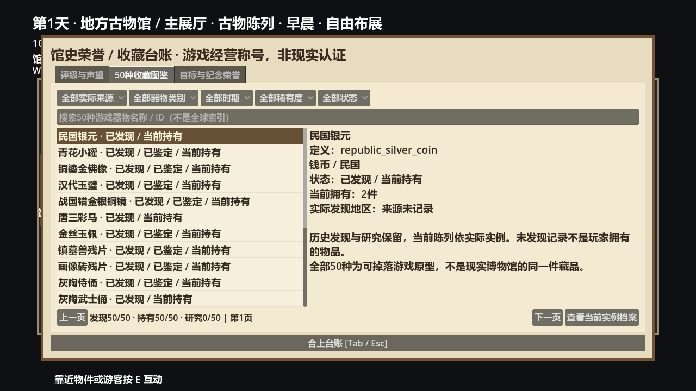
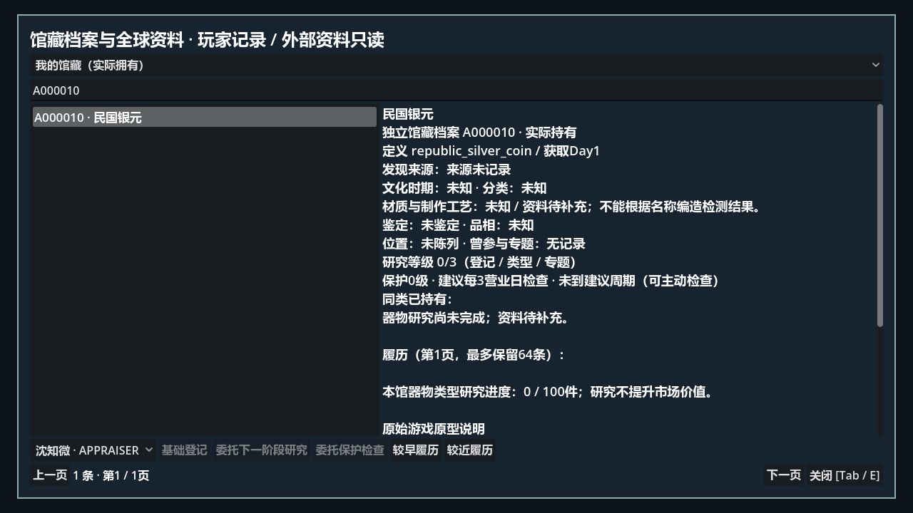
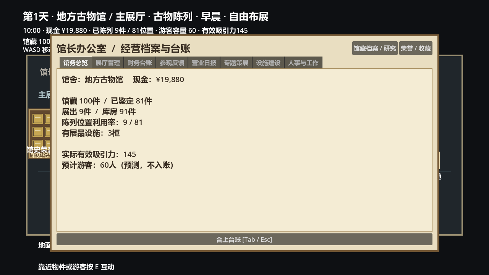
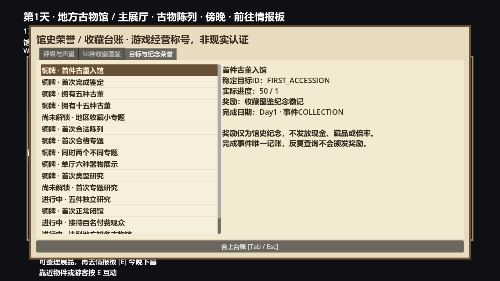

# Phase 11H 博物馆声望、评级、收藏与长期目标

自动验证完成，真人体验待验收（用户出差）。基线6d95292a8cd761abb1dbefb563816504641febcd；开始工作区干净，远端最初连接超时，重连后确认同一HEAD。独立分支codex/phase-11h-museum-reputation，不合并main。未读取/写入正式玩家存档；所有流程使用in_memory或明确隔离tests/logs路径。

## 评分与经营评级

配置data/museum/reputation.json，服务MuseumReputationService与MuseumRatingEvaluation。每个指标取配置上限后加权求和，最终向下取整；不写现金、不参与经营收入公式。MuseumLevels是建筑容量，经营评级独立；每级所有条件必须满足，不是单纯买馆舍或现金门槛。

|指标|权重|计分上限|
|---|---:|---:|
|identified|4|50|
|researched|6|50|
|topics|15|3|
|business_days|1|30|
|visitors|0.05|1000|
|displayed|2|50|
|quality|0.1|100|
|protected|2|20|

identified/researched/displayed/protected均按不同definition去重；research等级≥2，qualified专题按不同主题ID去重；营业日和付费观众仅来自唯一日期实际日报。quality为实际已鉴定陈列品相均值；protected要求实际陈列柜PROTECT>0且未到建议检查期。分数上限775，不改变票价、工资、维护、古董价值或战斗。

|评级|游戏称号|全部条件|
|---|---|---|
|1|私人收藏室|默认初始称号；零馆藏评分0|
|2|街坊陈列馆|identified≥5, displayed≥3, business_days≥1|
|3|地方知名古物馆|identified≥15, researched≥5, topics≥1, displayed≥8, business_days≥5, visitors≥50|
|4|区域文化名馆|identified≥30, researched≥15, topics≥2, displayed≥16, business_days≥15, visitors≥200, protected≥4, quality≥80|

评级是虚构游戏称号，不是1933年真实认证。当前实力按实际拥有与展示重新计算；卖出、撤展、专题不合格、检查到期会下降。历史纪念荣誉保留但不能保底当前评级。

## 50种收藏图鉴与可达性

MuseumCollectionCodex的分母严格来自playtest_catalog_50，研究目录50,794索引、候选和现实馆藏都不计入。状态为可组合布尔项：未发现UNKNOWN，实际曾取得DISCOVERED、已鉴定IDENTIFIED、类型研究完成RESEARCHED，以及当前OWNED数量。售出保留发现/研究、当前数量归零；重复20件仍只一种。长期历史每定义一条（最多50），独立档案仍按instance_id保存。

按实际来源地区、器物类别、文化时期、稀有度、状态与名称筛选；每页20条。来源未知保留未知，不从名称/当前地图推测。下表时期为原有游戏原型标签，经既有元数据分组，不代表新的专家审核；地区真实发现记录在实际带回后才出现。

旧8件仍按晋北旧规则；新42件（洛阳18、关中18、跨地区6）继续按11B现有地区/年代约束，未新增掉落或改变概率。phase_11b_catalog178项保留所有正式可用来源非零概率与年代验证；真实洛阳/关中Seeds33/52四条完整GameFlow回馆流程新增图鉴实际来源断言。三地区、Boss和双生尸煞历史回归均保留。

|定义ID|名称|器物类别|时期组|稀有度|
|---|---|---|---|---|
|republic_silver_coin|民国银元|COIN|民国|COMMON|
|blue_white_jar|青花小罐||未知|COMMON|
|gilt_buddha|铜鎏金佛像||未知|UNCOMMON|
|han_jade_disc|汉代玉璧|JADE|汉魏|UNCOMMON|
|inlaid_bronze_mirror|战国错金银铜镜|BRONZE|先秦|RARE|
|tang_sancai_horse|唐三彩马|CERAMIC_SCULPTURE|唐|RARE|
|gold_thread_jade|金丝玉佩||未知|TREASURE|
|guardian_fragment|镇墓兽残片||未知|TREASURE|
|ly_picture_brick|画像砖残片|FRAGMENT|汉魏|UNCOMMON|
|ly_attendant|灰陶侍俑|CERAMIC_SCULPTURE|汉魏|COMMON|
|ly_warrior|灰陶武士俑|CERAMIC_SCULPTURE|汉魏|UNCOMMON|
|ly_granary|陶仓明器|CERAMIC|汉魏|UNCOMMON|
|ly_well|陶井明器|CERAMIC|汉魏|COMMON|
|ly_stove|陶灶明器|CERAMIC|汉魏|COMMON|
|ly_pig|陶猪明器|CERAMIC_SCULPTURE|汉魏|COMMON|
|ly_dog|陶犬明器|CERAMIC_SCULPTURE|汉魏|COMMON|
|ly_green_jar|绿釉陶罐|CERAMIC|汉魏|UNCOMMON|
|ly_grey_tripod|灰陶小鼎|CERAMIC|汉魏|COMMON|
|ly_mirror|汉式铜镜|BRONZE|汉魏|RARE|
|ly_lamp|汉式铜灯|BRONZE|汉魏|RARE|
|ly_censer|汉式铜熏炉|BRONZE|汉魏|TREASURE|
|ly_jade_pendant|汉式玉佩|JADE|汉魏|RARE|
|ly_cicada|玉蝉|JADE|汉魏|TREASURE|
|ly_belt_hook|铜带钩|BRONZE|汉魏|UNCOMMON|
|ly_wuzhu|汉式五铢钱|COIN|汉魏|COMMON|
|ly_gilt_mount|鎏金铜饰片|JEWELRY|汉魏|RARE|
|gz_sancai_horse|三彩小马俑|CERAMIC_SCULPTURE|唐|RARE|
|gz_sancai_camel|三彩小驼俑|CERAMIC_SCULPTURE|唐|TREASURE|
|gz_sancai_attendant|三彩侍俑|CERAMIC_SCULPTURE|唐|UNCOMMON|
|gz_sancai_warrior|三彩武士俑|CERAMIC_SCULPTURE|唐|RARE|
|gz_sancai_jug|三彩小壶|CERAMIC|唐|UNCOMMON|
|gz_sancai_plate|三彩小盘|CERAMIC|唐|COMMON|
|gz_white_bowl|唐式白瓷小碗|CERAMIC|唐|COMMON|
|gz_white_ewer|唐式白瓷执壶|CERAMIC|唐|RARE|
|gz_celadon_cup|唐式青瓷盏|CERAMIC|唐|UNCOMMON|
|gz_dancer|彩绘舞俑|CERAMIC_SCULPTURE|唐|UNCOMMON|
|gz_silver_box|银盖盒|JEWELRY|唐|RARE|
|gz_gilt_cup|鎏金银杯|JEWELRY|唐|TREASURE|
|gz_gold_mount|金饰片|JEWELRY|唐|TREASURE|
|gz_silver_belt|银带饰|JEWELRY|唐|RARE|
|gz_jade_belt|唐式玉带饰|JADE|唐|RARE|
|gz_floral_mirror|唐式花纹铜镜|BRONZE|唐|RARE|
|gz_kaiyuan|唐式开元通宝|COIN|唐|COMMON|
|gz_guardian|镇墓小兽俑|CERAMIC_SCULPTURE|唐|TREASURE|
|shared_jade_ring|素面玉环|JADE|汉魏|UNCOMMON|
|shared_jade_bead|玉珠|JADE|汉魏|COMMON|
|shared_bronze_ring|铜环|BRONZE|汉魏|COMMON|
|shared_bronze_buckle|铜扣|BRONZE|汉魏|UNCOMMON|
|shared_pottery_cup|素面陶杯|CERAMIC|汉魏|COMMON|
|shared_pottery_jar|素面小陶罐|CERAMIC|汉魏|COMMON|

## 16个阶段目标与可见奖励

MuseumMilestoneService在实际collection.changed、state.changed、研究完成和日报首次store事件评价；打开/查询/刷新不写进度。MuseumAchievementRecord记录稳定ID、真实事件日期、指标值与纪念奖励；不重复领取。地域小专题配置要求实际同地区发现至少5种、至少2类；不是自动宣称收齐某个现实地区文物。

|目标ID|目标|条件|纪念奖励|30日流程完成日|
|---|---|---|---|---:|
|FIRST_ACCESSION|首件古董入馆|discovered≥1|收藏图鉴纪念徽记|1|
|FIRST_IDENTIFIED|首次完成鉴定|identified_history≥1|鉴定登记纪念证书|1|
|OWN_FIVE|拥有五种古董|owned≥5|五器收藏铜牌|1|
|OWN_FIFTEEN|拥有十五种古董|owned≥15|多样馆藏纪念牌|1|
|REGION_TOPIC|地区收藏小专题|region_topic≥1|地区收藏档案徽记|1|
|FIRST_DISPLAY|首次合法陈列|displayed≥1|开柜纪念铭牌|1|
|FIRST_EXHIBITION|首次合格专题|topics≥1|专题策展纪念证书|1|
|TWO_TOPICS|同时两个不同专题|topics≥2|双专题荣誉框|1|
|HALL_SIX|单厅六种器物展示|hall_unique≥6|展厅陈列纪念牌|1|
|FIRST_RESEARCH|首次类型研究|research_history≥1|研究登记徽记|1|
|FIRST_TOPIC_RESEARCH|首次专题研究|topic_research≥1|专题研究纪念证书|12|
|FIVE_RESEARCH|五件独立研究|research_instances≥5|研究工作纪念牌|3|
|FIRST_BUSINESS|首次正常闭馆|business_days≥1|开馆纪念纸档|1|
|HUNDRED_VISITORS|接待百名付费观众|visitors≥100|百客纪念铜牌|10|
|LOCAL_RATING|达到地方知名古物馆|rank≥2|地方知名馆游戏称号|5|
|THIRTY_DAYS|三十日经营记录|business_days≥30|三十日馆史纪念框|30|

以上16项全部由隔离实际馆藏、合法布展/专题、实际员工研究、真实OPEN和闭馆流程达到，非直接写成就布尔。已实际达到第四级评级。反复取消/开同一专题20次分数与荣誉不变；撤展使专题当前合格数下降但历史双专题纪念仍在。同一日期日报重复store被拒绝，付费观众、票款与荣誉不变。荣誉墙实际木框与铜牌亮起，台账显示具体纪念牌、证书、完成日与凭据；奖励无钱、古董、倍率或战斗属性。

## 30日经营与性能

真实MuseumBusiness每次开馆、员工实际OPEN处理、闭馆结算：开馆前现金43410（已支付隔离合法鉴定/修复/建设/招聘费用），门票1650，工资960，维护270，本期修复费0，末现金43830。43410+1650-960-270=43830，营业净收益420。330名实际付费观众，30份唯一日报。独立研究20件、研究定义20种、一个专题研究；两个实际合格专题；当前43种馆藏/43种陈列、平均品相100、保护有效5种。声望474，经营评级4。研究、员工、保护和日报往返完整相等。

UI打开/刷新（headless同机实测，非硬件保证）：50件11.70ms、100件8.96ms、500件22.95ms，均20个可见列表项；实际图鉴只50条定义，不创建500个同时显示控件。未知/当前持有/地区筛选均实际UI断言验证。全50,794研究JSON未加载。

## VERSION10兼容与安全

保留v1～9读取和首次写新版原始字节备份。保留11G档案及真实source、研究/检查/修复、员工队列与工资、设施、专题、费用链、日报、现金、拍卖、展位、Campaign。旧档当前可验证馆藏计算进度，历史日期未知保持0，迁移不颁发假荣誉。后续只读仍不颁奖；实际新事件可以记录当时的新里程碑，不回填过去日期。收藏/研究旧未知日期在无新事实时不被普通操作替换。

v10纯值往返、v9字节备份、未知研究ID、错误地区、未来荣誉日期、重复/不合法档案及外部修改拒绝覆盖；OPEN/NIGHT原禁止保存保护不变。最多50收藏历史、每定义3地区、16荣誉；不存研究目录或图片。历史荣誉是稳定完成记录，当前评级仍纯评价，不因读档重复发奖。

## 回归与图形

最终59组Godot headless汇总 **338,474 checks，0 failures**，所有退出0，无SCRIPT ERROR/ERROR。Python数据库历史107 tests通过；导入正常，正式GameFlow场景隔离启动3项通过，空馆/零现金/无赠品。真实Godot图形专项17项通过，实际WASD/E/鼠标访问荣誉墙、评级、图鉴、实例档案、办公室分组、售票与实际员工研究闭馆获奖。

第一轮历史批次发现10D.6两项完整等值断言失败：当前版本建造的v4夹具误带新成就，与合法“不伪造旧荣誉”迁移矛盾。修正历史夹具明确暂停新事件、移除新扩展字段，保留原完整资产等值及往返断言，并增加旧荣誉日期未知检查；完整10D.6重跑92项通过。9A完整迁移回归10513项重跑通过。最终表含修正后完整组结果；原失败日志未掩盖，所有旧断言保留。后续筛选9项新增与JSON规则提取再跑11H3/4/5，未删除断言。

|组|检查|失败|
|---|---:|---:|
|1|27|0|
|2|204|0|
|3|94|0|
|4|105|0|
|5a|61|0|
|5b|236|0|
|6|164|0|
|6_5|174|0|
|7a|306|0|
|7b|722|0|
|8a|486|0|
|8b|305|0|
|8c|297|0|
|8d|2153|0|
|9a|10513|0|
|9b|30758|0|
|9b2|4843|0|
|9b3|29133|0|
|9b32|1734|0|
|9b33|2702|0|
|geometry|206885|0|
|softlock|1030|0|
|baseline|728|0|
|10a|49|0|
|10d_bridge|9|0|
|10d_media|11|0|
|10d|40|0|
|10d6|92|0|
|11a|717|0|
|11b_tombs|1172|0|
|11b_catalog|178|0|
|11b|40984|0|
|twin_death_hotfix|47|0|
|11d1|7|0|
|11d2|20|0|
|11d3|9|0|
|11d4|169|0|
|11d5|235|0|
|11d_flow|108|0|
|11e1|335|0|
|11e2|19|0|
|11e3|9|0|
|11e4|131|0|
|11e5|10|0|
|11f1|23|0|
|11f2|18|0|
|11f3|14|0|
|11f4|129|0|
|11f5|27|0|
|11g1|4|0|
|11g2|9|0|
|11g3|5|0|
|11g4|18|0|
|11g5|75|0|
|11h1|5|0|
|11h2|5|0|
|11h3|24|0|
|11h4|25|0|
|11h5|82|0|

运行命令（Godot4.6.2；Godot替换本机可执行路径）：

```powershell
Godot --headless --editor --import --path .
Godot --headless --fixed-fps 60 --path . --script tests/phase_11h5_smoke.gd
Godot --fixed-fps 60 --path . --script tests/phase_11h_graphical.gd
Godot --path . --script tests/phase_11h_playtest.gd
python -m unittest discover -s database/tests
```

完整回归按历史phase_*_smoke.gd逐组运行，特殊入口保留phase_10d_bridge.gd、phase_10d_media.gd、phase_softlock_smoke.gd和phase_player_baseline_smoke.gd。没有以削减断言换取通过；旧当前VERSION断言9→10，历史v4/v9夹具仍对应原年代。

## 五阶段提交与交付

1. bc502d8 声望与独立评级。
2. 0c71940 50种收藏与历史证据。
3. a18df12 事件驱动阶段目标。
4. 59a86dc 荣誉墙、分组界面与v10。
5. 本报告所在最终提交：实际GameFlow、图形、全部回归与报告；最终SHA见交付消息/本提交Git日志（避免自引用）。

完成后push codex/phase-11h-museum-reputation，不合并main。正式存档不操作；tests/phase_11h_playtest.gd启动内存100件馆藏/测试资金/员工与真实任务，玩家位于荣誉墙旁。可以E查看目标，再去售票台实际营业解锁研究与营业荣誉。

## 人工待验与限制

真人体验尚未通过，用户出差等待回来验证：评级条件表达、收藏筛选、荣誉奖励展示、目标节奏、保护到期评级变化是否易懂。数值为首版策划阈值，自动测试只证明可达与一致，不证明经济或长期节奏好玩。旧档未记录的日期/来源/客流不补造；限量离馆档案裁剪不删除收藏历史。所有研究审批/候选/媒体授权保持原状，游戏称号无真实认证含义。不进入下一阶段。

## 真实Godot截图















